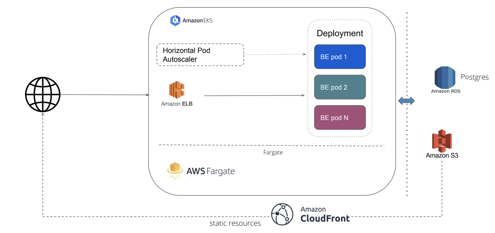

# Crowdsourcing Platform

<!-- TABLE OF CONTENTS -->
## Table of Contents

- [Crowdsourcing Platform](#crowdsource_platform)
  - [Table of Contents](#table-of-contents)
  - [About The Project](#about-the-project)
    - [Built With](#built-with)
  - [Getting Started](#getting-started)
    - [Prerequisites](#prerequisites)
    - [Installation](#installation)
  - [Usage](#usage)
    - [Common configuration steps:](#common-configuration-steps)
      - [Setting credentials for Google cloud bucket](#setting-credentials-for-google-cloud-bucket)
      - [Setting credentials for AWS cloud bucket](#setting-credentials-for-aws-cloud-bucket)
      - [Bucket configuration](#bucket-configuration)
      - [Environment file configurations](#environment-file-configurations)
  - [Running services](#running-services)
  - [Contributing](#contributing)
  - [License](#license)
  - [Contact](#contact)


<!-- ABOUT THE PROJECT -->
## About The Project
This is a web application which can be used to crowdsource audio and validate them for various languages. The application makes use of NodeJs, Postgres for Database. It can be hosted on any cloud platform. The current application has code to support AWS and GCP as providers to store the recorded information.
Crowdsourcing Platform’s developer documentation is meant for its adopters, developers and contributors.

The developer documentation helps you to get familiar with the bare necessities, giving you a quick and clean approach to get you up and running. If you are looking for ways to customize the workflow, or just breaking things down to build them back up, head to the reference section to dig into the mechanics of Crowdsourcing Platform.

Data Collection Pipeline is based on an open platform, you are free to use any programming language to extend or customize it but we prefer to use python to perform smart scraping.

The Developer documentation provides you with a complete set of guidelines which you need to:

* Install dependencies for the Crowdsourcing Platform  
* Configure Crowdsourcing Platform
* Customize Crowdsourcing Platform  
* Extend Crowdsourcing Platform  
* Contribute to Crowdsourcing Platform


### Built With
We have used Node.js to build this platform.
* [Node](https://nodejs.org/)

<!-- GETTING STARTED -->
## Getting Started

To get started install the prerequisites and clone the repo to machine on which you wish to run the application.

## Architecture



### Prerequisites
1. Install `node` library using commands mentioned below.
    * For any linux based operating system (preferred Ubuntu):
      
        ```
        sudo apt-get install nodejs
        ```
      
    * For Mac-os:
      
        ```
        brew install node
        ```
      
    * Windows user can follow installation steps on [https://nodejs.org/en/#home-downloadhead](https://nodejs.org/en/#home-downloadhead)

2. Install or connect to a postgres database

3. Get credentials from google developer console for google cloud storage access/ or aws cli for amazon s3 storage access.

### Installation

1. Clone the repo using
   
    ```
    git clone https://github.com/Open-Speech-EkStep/crowdsource-dataplatform.git
    ```
   
2. Go inside the directory
   
    ```
    cd crowdsource-dataplatform
    ```
   
3. Install node requirements
   
    ```
    npm install
    ```


<!-- USAGE EXAMPLES -->
## Usage

### Common configuration steps:
#### Setting credentials for Google cloud bucket
You can set credentials for Google cloud bucket by running the following command
```
gcloud auth application-default login
```

#### Setting credentials for AWS cloud bucket
You can set credentials for AWS cloud bucket by running the following command
```
aws configure
```

#### Bucket configuration
You can create a specific bucket to store the recorded samples on aws or gcp. And mention those in the environment variables.

#### Environment file configurations
The following are the variables required to run the application, for running on local these can be added to a .env file

```
DB_HOST: The host url where your postgres instance is running
DB_USER: The username to access the db
DB_NAME: The database name
DEV_DB_NAME: The database name specific to dev environment
DB_PASS: The database password
BUCKET_NAME: The bucket name configured on aws or gcp
ENCRYPTION_KEY: Key to run unit tests
PORT: Port to run the application on
```
        
<!-- RUNNING THE SERVICES -->
## Running services

Make sure the google credentials are present in project root folder in credentials.json file.

You can run the project using the command

```
npm run
```

To run application using a Google cloud bucket

```
npm run gcp
```

To run application using a AWS cloud bucket

```
npm run aws
```


<!-- CONTRIBUTING -->
## Contributing

Contributions are what make the open source community such an amazing place to be learn, inspire, and create. Any contributions you make are **greatly appreciated**.

1. Fork the Project
2. Create your Feature Branch (`git checkout -b feature/AmazingFeature`)
3. Commit your Changes (`git commit -m 'Add some AmazingFeature'`)
4. Push to the Branch (`git push origin feature/AmazingFeature`)
5. Open a Pull Request


<!-- LICENSE -->
## License

Distributed under the [MIT] License. See `LICENSE` for more information.


<!-- CONTACT -->
## Contact

Your Name - [@your_twitter](https://twitter.com/your_username) - email@example.com

Project Link: [https://github.com/Open-Speech-EkStep/crowdsource-dataplatform/](https://github.com/Open-Speech-EkStep/crowdsource-dataplatform/)

