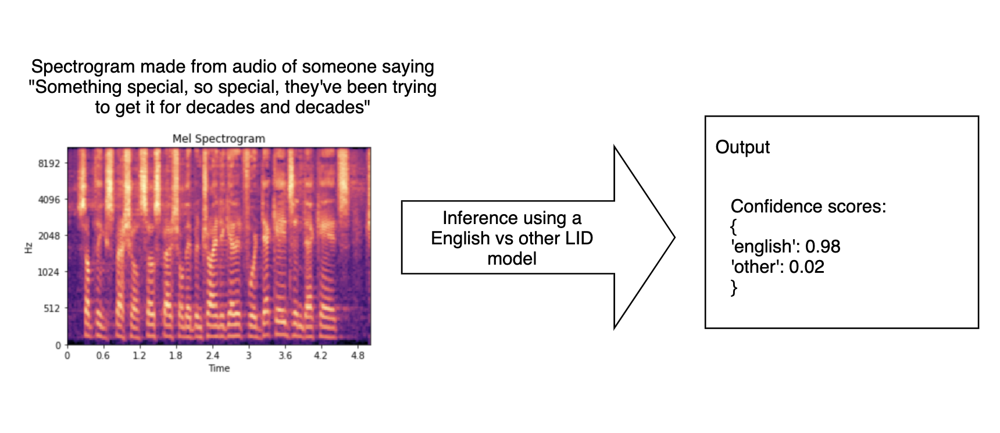

# Language Identification

<!-- TABLE OF CONTENTS -->
## Table of Contents

- [Language Identification](#language-identification)
  - [Table of Contents](#table-of-contents)
  - [About The Project](#about-the-project)
  - [Working](#working)
    - [Training](#training)
    - [Train data](#train-data)
    - [Results](#results)

  - [Usage](#usage)
    - [Preparing the Data](#preparing-the-data)
    - [Training the Model](#training-the-model)
    - [Inference](#inference)

<!-- ABOUT THE PROJECT -->
## About The Project

Language Identification works for classifying the audio utterances into different classes. This repository can work for 2 or more classes depending on the requirement. 

This utility is a part of our Intelligent Data Pipelines. For all the data crawled, we can't always be a 100% sure that it only belongs to the language we want to train our Speech Recognition model on. Thus we train a language identification model on a different, limited set of data, to aid us in finding (or eliminating) files that have high content of foreign language. 

Since we also pass the datasets used for training LID through our pipelines, we can assume that VAD has split all original audios into small chunks with minimum overlap between languages, for training.Another assumption is that the training data comes from a wide variety of environments.

We train a ResNet18 model on the spectrograms extracted from audio utterances. During inference, we return a confidence score value for each class (provided by user during training) for an input audio.

<!-- WORKING -->
## Working

### Training
We extract spectrograms from audio utterances and use them to train a CNN based classifier: ResNet18, which is 18 layers deep. 
We don't use the pretrained version, and treat Language Identification as an image classification problem.

Users can decide upon the number of classes they want to train on. We follow a one vs other approach where main language is the one we want to classify against. 

Outputs for each audio are confidence scores for different labels.



### Train data
We trained a Tamil vs others classification model, with 30-40 hours data for each of the classes- Tamil and Other.

Validation data consisted of roughly 14 hours of data, balanced between the classes.

## Usage

### Preparing the Data

Keep separate audio folders for different classes as well as the train and valid sets of each. The audio files should be present in .wav format.
To prepare the data, edit the data paths in file data/create_manifest.py.

To run the file:
```python
python create_manifest.py
```
This creates the train and valid csv files in the ```data/ ```directory.

### Training the Model
Edit the train_config.yml file for the training parameters. Give the file path for train and valid csv's created while preparing the data.

To start the training, run:
```python
python train.py
```

### Inference
Edit the language_map.yml to map the labels(0,1, etc) with the languege names or codes('hi','en', etc)

To infer, edit inference.py file and provide the best_checkpoint path and audio file name.

Parameters:

model_path : Path to best_checkpoint.pt

audio_path : Audio file path

Run the file:
```python
python inference.py
```
This runs on a single audio file.

