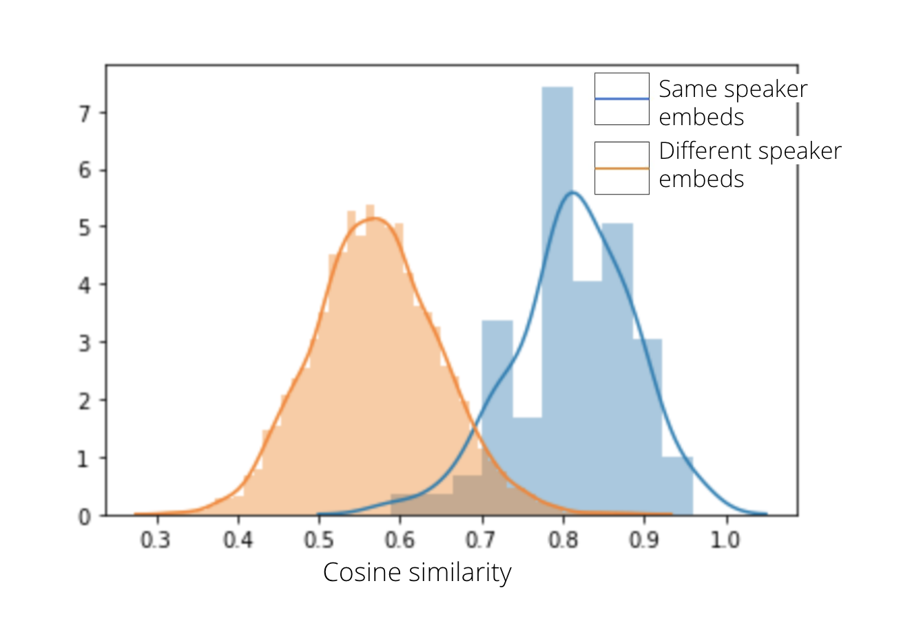
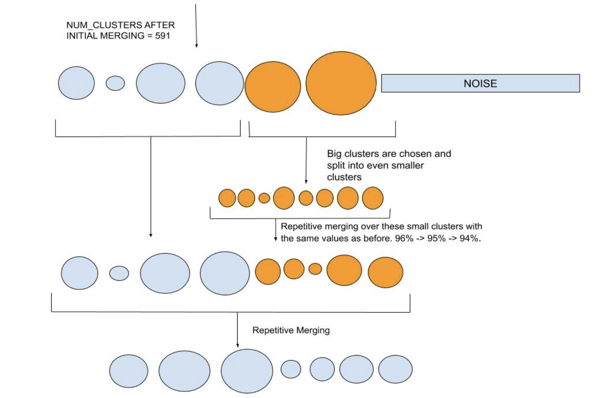

# Speaker Clustering

<!-- TABLE OF CONTENTS -->
## Table of Contents

- [Speaker Clustering](#speaker-clustering)
  - [Table of Contents](#table-of-contents)
  - [About The Project](#about-the-project)
  - [Working](#working)
    - [Embeddings](#embeddings)
    - [Clustering algorithm](#clustering-algorithm)
    - [Repetitive merging](#repetitive-merging)
    - [Splitting](#splitting)
    - [Fitting Noise points](#fitting-noise-points)
  - [Hyperparameters](#hyperparameters)

<!-- ABOUT THE PROJECT -->
## About The Project

Speaker Clustering, or identification of speakers in the wild is mainly useful for audio sources with no mapping between audios and a speaker label/name.

It is the task of identifying the unique speakers in a set of audio recordings (each belonging to exactly one speaker) without knowing who and how many speakers are present in the entire data. 

Our intelligent data pipelines split each audio, based on Voice Activity Detection, as one of the starting steps. These shorter audio utterances are then used to train deep learning models. We assume that the utterances are short enough to have one speaker per utterance, since the splitting logic is using unvoiced segments as points to split an audio.

<!-- WORKING -->
## Working

This documentation will help you understand the various steps involved and take you through the hyperparameters, so you can tune them to achieve the best possible results.

### Embeddings
We use the Voice Encoder model proposed [here](https://arxiv.org/abs/1710.10467), and implemented [here](https://github.com/resemble-ai/Resemblyzer) for converting our audio utterances into fixed length embeddings.

<i>System overview for training Voice encoder. Different colours indicate utterances/embeddings from different speakers.</i> 

Voice Encoder is a speaker-discriminative model trained on a text-independent speaker verification task. Thus it allows us to derive a high-level representation of the voice present in an audio. An embedding is a 256 dimensional vector capable of summarizing the characteristics of the voice spoken. The data used to train the model contained 1.8k speakers from LibriSpeech-other, Voxceleb, Vox celeb2; making a final of more than 1000 hrs of data in English. Since our experiment sources for audios were in Hindi, we did a small experiment to determine whether embeddings on Hindi data using this pretrained model were able to separate speakers. The resulting _dist plot_ is presented below. x-axis is the Cosine Similarity.

<i>A distplot showing separation between embeddings belonging to different speakers, based on Cosine similarity.</i> 

### Clustering algorithm

Embeddings for a source are passed as a matrix for clustering in this step.
If the number of embeddings are greater than the parameter _partial_set_size_, they are divided into multiple partial sets of this size. This step is done to reduce the computational cost of calculating cosine distances and other matrix operations during clustering.

We use Hierarchical Density-Based Spatial Clustering of Applications with Noise (HDBSCAN) as our core clustering algorithm on each of these partial sets.
This step also classifies some points as noise points - meaning they couldn't be used up in any clusters formed for this partial set. We keep a record of all these noise points for fitting later.

### Repetitive merging
We found in our experiments that some of the speakers had their clusters distributed as separate ones - even in one partial set. This step helps in allowing such clusters to merge. Merging is based on cosine similarity (94-96% similar clusters are merged repetitively).
Also, clusters for the same speaker but from different partial sets also get merged in this step.

<i>Initial EOM clustering and repetitive merging of clusters.</i> 

### Splitting
For some sources in our experiments, big clusters usually contained very high diversity of speakers. Splitting is done on such "bigger" clusters to make sure we have high cluster purity. A cluster is called big if it has more than 3 times the average number of points across all clusters.
We also tried splitting a large cluster containing audios from one speaker only and it was retained as is, meaning this step should not affect large clusters belonging to one speaker only.
Cluster splitting is achieved by using Leaf HDBSCAN clustering on the big clusters. This allows for more more fine grained clustering. More details on this follow in the next section.

Repetitive merging is applied again after splitting to allow clusters with high cosine simialrities to be merged again, if any.

<i>Splitting big clusters and repetitive merging of clusters.</i> 

### Fitting Noise points

All the noise points - points which could not be put into a cluster, are allowed to merge with a clusters if they have a cosine similairy of >= 80% with a noise point. This parameter is also configurable. 

<!-- HYPERPARAMETERS -->
## Hyperparameters

- min_cluster_size: 
    - the smallest size grouping that you wish to consider a cluster
    - min_cluster_size can be increased if the source is expected to have large number of utterances for a less number of speakers.

- min_samples: 
    - number of points required in the neighborhood of a point to be considered a core point
    - smallest value = 1, max value = min_cluster_size
    - smaller values of min_samples have an effect of lowering the number of noise points
    - in our experiments, around 30% of points across a source were being classified as noise before fitting. You can try with _min_samples=1_ for least possible noise points classification.

- partial_set_size:
    - number of utterances to treat as one set for clustering. 
    - We used _partial_set_size_=11122 as this number represents around 20 hours of data on an average for us, and was computationally less demanding.

- fit_noise_on_similarity:
    - cosine similarity between a noise point and a cluster, at which the point can be fit to a cluster.
    - default = 0.80, meaning points with cosine similarity >=0.80 with a cluster's mean embedding will be fit to that cluster.
    - values of _fit_noise_on_similarity_ lesser than 0.80 can have an effect of decresing cluster purity.

- cluster_selection_method: can either be ‘eom’ or ‘leaf’
    - 'eom' or Excess of Mass is the default way of HDBSCAN's working. 
    - 'leaf' will select leaf nodes from the tree, producing many small homogeneous clusters. Allowing for fine-grained clusters. This is used while splitting clusters into smaller ones.